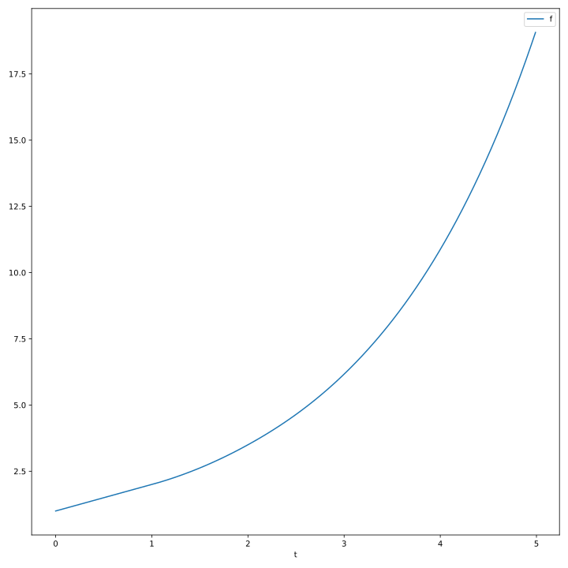

# Integrator

I wanted to play with some systems and decided to write simulation framework from scratch to understand how it works, so here it is.

Let's see how it works on example. 

Put the following into `code.txt`:
```
T0: 0.0
T1: 5.0
DT: 0.01            # simulation time step
METHOD: Heun        # numerical method, currently "Heun" or "Euler"

DEFINE:             # they are evaluated and then substituted into the equations
k: 1.0
delay: 100 * DT     # delays should be multiples of DT
f0: 1.0

INIT:               # initial values
f: f0
f[delay]: f0

DIFF:               # expressions for derivatives, 0 if not specified
f: k * f[delay]
```

Now run `python sim.py` to get the values in `result.csv` and `python show.py` to plot them:


By the way, this function can be written analytically as:

$$f(x) = \sum_{n=0}^{\infty} \frac{\max(0, x - n + 1)^n}{n!}$$

